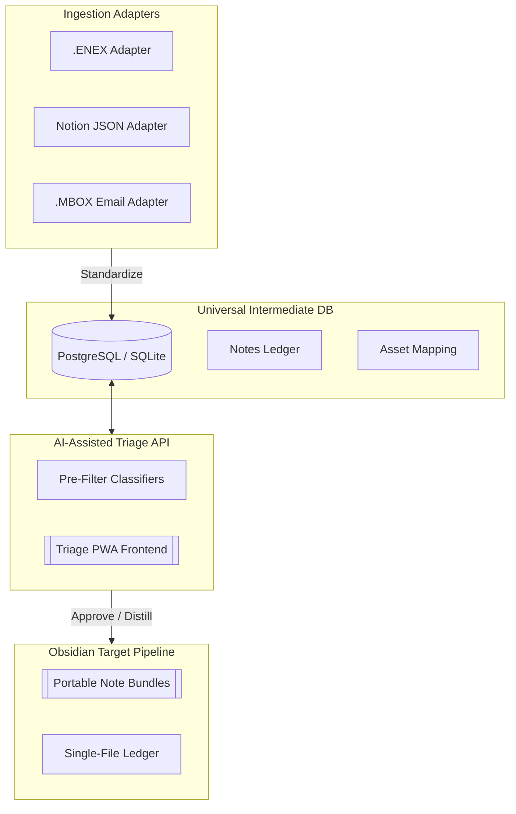

# 🏛️ Archivist Core
> *The Universal Translation Layer and Multi-Provider Inbox for Structured Personal Knowledge Graphs.*

Archivist Core is an elite, enterprise-grade engine engineered to ingest, parse, and normalize complex, messy data from disparate digital brain ecosystems (Evernote, RemNote, Notion, Inbox) and pipeline them into resilient, high-property Markdown notes optimized for Obsidian and Logseq.

---

## 🏛️ Project Architecture

---

## 🏗️ Directory Structure

- `database/`: SQL schema DDL and universal index migrations.
- `core/`: Strict Type Hinted entity models (Notes, Attachments, Collections).
- `adapters/`: Extensible provider implementations utilizing the Abstract Base Adapter.
- `classifiers/`: Intelligent heuristic engines for flagging junk images/content.

---

## 🧬 Elite Standards

1. **Zero Plagiarism**: Clean-room engineered.
2. **Strict Type Safety**: Fully typed Python 3 and TypeScript models.
3. **Documentation First**: Docstring architectures on every component.
