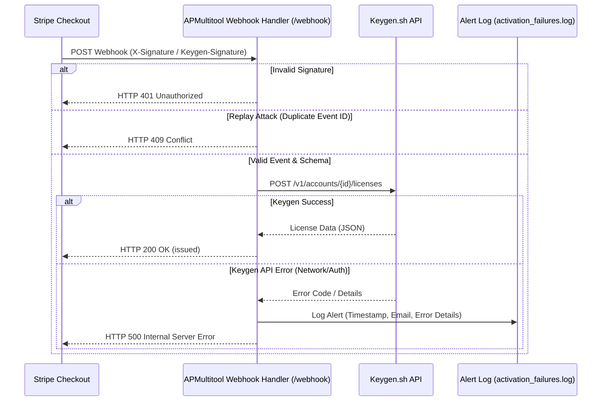

# 💳 APMultitool First-Dollar Monitoring & License Path

This document outlines the end-to-end integration path from a purchase event on Stripe to license activation in Keygen.sh, details the active monitoring system, and provides instruction on checking activation-failure logs.

---

## 🔗 End-to-End License Path Architecture

The billing integration operates in a unified event loop flow:


### 1. Purchase Event Ingestion
The webhook server exposes an endpoint to receive events from payment gateways like Stripe or Keygen. Supported events include:
- `checkout.paid`
- `payment.success`
- `license.created`

The server performs strict signature checks using `hmac.compare_digest` with constant-time comparison on the payload combined with the timestamp to prevent timing attacks. It also implements a 300-second sliding expiration window to mitigate replay attacks.

### 2. Downstream Keygen API Call
Upon receiving a verified paid event, the handler invokes `issue_keygen_license` to call Keygen's API:
- **URL**: `https://api.keygen.sh/v1/accounts/{account_id}/licenses`
- **Method**: `POST`
- **Headers**:
  - `Content-Type: application/vnd.api+json`
  - `Accept: application/vnd.api+json`
  - `Authorization: Bearer {APM_KEYGEN_PRODUCT_TOKEN}`
- **Payload**: Issues a license referencing the `ap-multitool-pro` policy, mapping the customer's email securely in the metadata field.

---

## 🚨 Activation-Failure Alerting

When the downstream license creation fails (e.g., due to Keygen API outage, rate limiting, or bad credentials), the handler logs the failure to a dedicated file:

- **Path**: `data/activation_failures.log`
- **Format**: JSON Lines (JSONL) format for easy parsing and monitoring.

### Sample Alert Entry
```json
{"timestamp": "2026-07-03T15:08:42.123456Z", "email": "fail@example.com", "error": "RuntimeError: Keygen API error: [REDACTED]"}
```
> [!IMPORTANT]
> The alert logs automatically redact sensitive credentials (`APM_KEYGEN_PRODUCT_TOKEN` and `APM_WEBHOOK_SHARED_SECRET`) before writing to disk, ensuring logs remain safe to share.

---

## 🔒 Paywall Configuration

The paywall is fully locked and enforced by default for production:
- **Variable**: `APM_PAYWALL_ENFORCED`
- **Production Default**: `1` (or `True`) — Enabled.
- **Verification**: Defined in `config.py` as:
  ```python
  PAYWALL_ENFORCED: bool = os.environ.get(
      "APM_PAYWALL_ENFORCED", "1"
  ).lower() in ("1", "true", "yes", "on")
  ```

---

## 🛠️ Verification & Run Instructions

To verify the webhook server is receiving Stripe events and Keygen calls properly:
1. Start the webhook server locally:
   ```bash
   python -c "from core.webhook import run_webhook_server; run_webhook_server(8080)"
   ```
2. Trigger a test event using curl (simulate Stripe paid webhook):
   ```bash
   # Use tests/test_webhook.py to generate valid signatures, or run pytest
   python -m pytest tests/test_webhook.py -v
   ```
