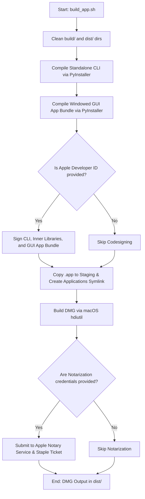

# macOS Packaging Overview

This document details the macOS packaging process for the Access Paralegal Multitool (APMultitool). macOS packaging produces both a standalone CLI binary (`apmultitool`) and a graphical Application Bundle (`Access_Paralegal_Multitool.app`) wrapped inside a native Apple Disk Image (`.dmg`) installer.

---

## 🛠️ Build Script: `packaging/macos/build_app.sh`

The compilation is automated by the [build_app.sh](file:///C:/Users/aewoo/Desktop/Repos/ap-multitool/packaging/macos/build_app.sh) orchestrator.

### Parameters
The script accepts the following parameters:
```bash
bash packaging/macos/build_app.sh [AppVersion] [ReleaseChannel] [SignIdentity] [TeamId] [AppleID] [ApplePasswordVarName]
```
1. **`AppVersion`**: The application version (defaults to `1.0.0`).
2. **`ReleaseChannel`**: Channel suffix (defaults to `-alpha1`).
3. **`SignIdentity`**: The common name of the Apple Developer ID Application certificate.
4. **`TeamId`**: The 10-character Apple Developer Team ID.
5. **`AppleID`**: The Apple Developer email account.
6. **`ApplePasswordVarName`**: The name of the environment variable storing the Apple App-Specific Password.

---

## 🏗️ Compilation & Packaging Flow



### 1. PyInstaller Bundling
PyInstaller compiles two executable artifacts:
- **CLI Binary (`dist/apmultitool`)**: Compiled from `cli.py` in console mode.
- **GUI Application Bundle (`dist/Access_Paralegal_Multitool.app`)**: Compiled from `gui_apmultitool.py` in windowed mode with embedded resource assets (`logo_small.png` and `water_texture.png`).

> [!IMPORTANT]
> The macOS directory separator parameter syntax for `--add-data` is a colon (`:`), e.g., `logo_small.png:.`, which differs from the semicolon (`;`) separator required by Windows.

### 2. Disk Image (DMG) Creation
To package the app for standard macOS installations:
1. The script creates a staging area (`dist/dmg_stage`).
2. It copies the `Access_Paralegal_Multitool.app` bundle into it.
3. It creates a symlink to `/Applications` (`ln -s /Applications dist/dmg_stage/Applications`).
4. It calls native macOS `hdiutil` to package the staging folder into a read-only, compressed DMG:
   ```bash
   hdiutil create -volname "APMultitool Installer" -srcfolder dist/dmg_stage -ov -format UDZO dist/APMultitool_Setup_v1.0.0-alpha1.dmg
   ```

---

## ⚠️ Prerequisites & Hardware Blockers
Executing this packaging script requires:
- A macOS workstation or runner (running macOS Catalina 10.15 or newer).
- PySide6 and standard application Python dependencies installed.
- **Developer Credentials**: To run outside developer workstations without security warnings, the bundle must undergo the signing and notarization process (documented in [macos_signing_requirements.md](file:///C:/Users/aewoo/Desktop/Repos/ap-multitool/docs/ops/macos_signing_requirements.md)).
