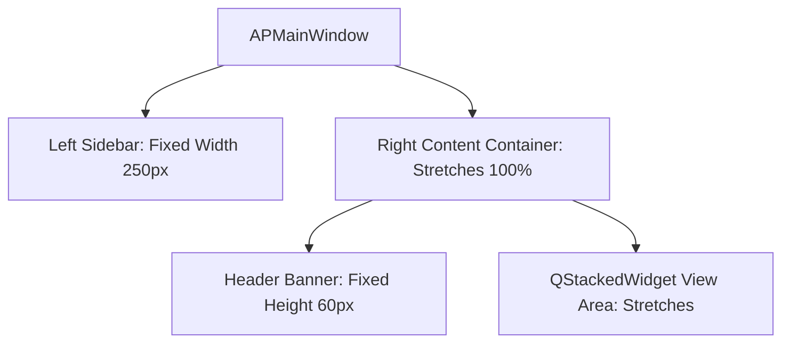

# APMultitool Qt Shell Responsive Design Notes

This document governs viewport reflow rules and touch targets for desktop and landscape tablet form-factors.

---

## 📐 1. Viewport Target Scale

The shell supports a dynamic scale responsive to user resizing:

- **Desktop HD Standard**: `1280x800px` (Optimal layout, 2-column splitter expands fully).
- **Tablet / Laptop Standard**: `1024x768px` (iPad Landscape & standard Android tablets).
- **Minimum Enforced Viewport**: `800x600px`. The main window cannot be resized smaller than this threshold to prevent visual overlaps.

---

## 🏛️ 2. Sidebar & Content Scaling Policies

To maintain side-by-side consistency:
1. **Sidebar Frame**: Set to a hard fixed width: `min-width: 250px` and `max-width: 250px`. This prevents the sidebar from expanding or compressing when the main window resizes.
2. **Horizontal Splitter**: Separates left parameter cards from right lists. The left panel is set to a fixed width of `320px` to `340px`. The right table/console is set to stretch (`QtWidgets.QSizePolicy.Expanding`), absorbing 100% of the window resize delta.
3. **Stacked Viewports**: If the window width shrinks below `900px`, the splitter allows manual adjustment, and column sections scroll horizontally if text truncates.

---

## 🖲️ 3. Touch-Target Standards for Tablets

For tablet ergonomics, touch controls conform to human interface tap target minimums:

1. **Tap Sizing Bounds**:
   - Navigation Buttons: Height is `44px` minimum (`padding: 12px 15px`).
   - Run Action Buttons: Height is `40px` minimum with generous touch padding.
   - Secondary Controls (Add/Clear): Height is `32px` minimum.
2. **Field Heights**:
   - Dropdowns (`QComboBox`) and Inputs (`QLineEdit`) maintain a minimum heights of `32px` to prevent selection slips.
   - Checkbox Indicators: Box size is styled to `18x18px` with `8px` spacing to separate checkbox label taps.
