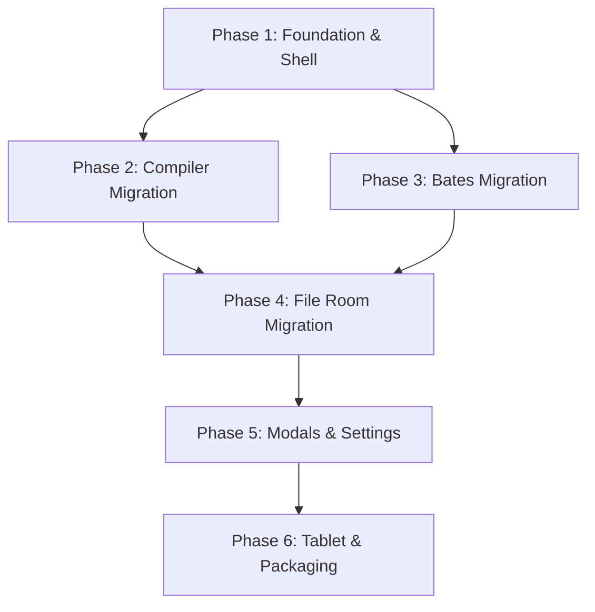

# APMultitool Qt Migration Roadmap

This document outlines the roadmap for migrating the APMultitool desktop graphical user interface from CustomTkinter to **PySide6 / Qt Widgets**, targeting Windows, macOS, Linux, and tablets (Android & iOS).

---

## 📅 1. Migration Phases

### 🏁 Phase 1: Foundation, Hardened Shell, & Primitives (COMPLETED)
- **Objective**: Establish codebase directory structures, QSS design styles, main window, navigation sidebar, shared UI components, standardized native dialogs, and generic async engine worker interfaces.
- **Deliverables**:
  - `apmultitool_qt/` app modules.
  - Sidebar layout and refined placeholder views.
  - Shared components: `SectionCard`, `FormRow`, `ActionBar`, `HintLabel`, `EmptyStateWidget`.
  - Standardized alerts (`dialogs.py`) and native file utilities (`file_dialogs.py`).
  - Thread-safe `EngineJobWorker` support for progress updates and cancellation hooks.

### 📄 Phase 2: Document Compiler Tab Migration (COMPLETED)
- **Objective**: Migrate the document merge list and queue control actions.
- **Deliverables**:
  - `QTableWidget` representing the files queue with drag-and-drop row reordering.
  - Options frames styled with custom borders.
  - Action buttons (`Combine & Merge Files`, `Cancel`).
  - Integration with the core merge engine thread using Qt's `QThread` and custom Signal boundaries.

### 🔢 Phase 3: Bates Stamping Tab Migration (COMPLETED)
- **Objective**: Migrate the Bates stamping setup, console logger, and options modal.
- **Deliverables**:
  - File picker, prefix, and index input fields.
  - Live scrollable log terminal output view.
  - Custom Settings dialog showing compliance options, with Return/Enter and Escape binders.
  - Cooperative stamping cancellation hook.

### 🏛️ Phase 4: File Room & Case Trees Migration (COMPLETED)
- **Objective**: Migrate Case blueprints loader and tree visualizer.
- **Deliverables**:
  - Case Matter number input.
  - Interactive Tree View representing directories to create.
  - "Spin Up Folder Tree" execution hooks.

### ⚙️ Phase 5: Global Modals & System Settings (COMPLETED)
- **Objective**: Port global preference dialogs, EULA, and licensing frames.
- **Deliverables**:
  - About modal with security token calculations and CLI help instructions.
  - Preferences modal with theme selections (Light, Dark) and workspace relocate options.
  - License Activation modal with Return key hook.

### 📱 Phase 6: Tablet Optimization & Packaging
- **Objective**: Refine sizing policies, expand touch targets, and package cross-platform.
- **Deliverables**:
  - Tablet-first responsive layout tests.
  - PyInstaller compile script updates for Windows, macOS, and Linux.
  - Initial packaging tests for Android tablets.
